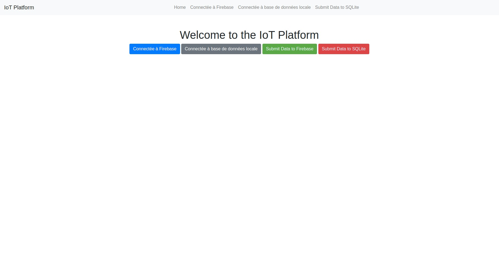
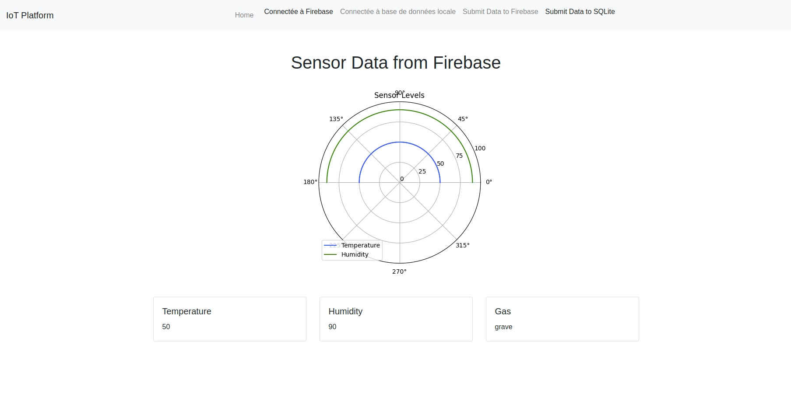
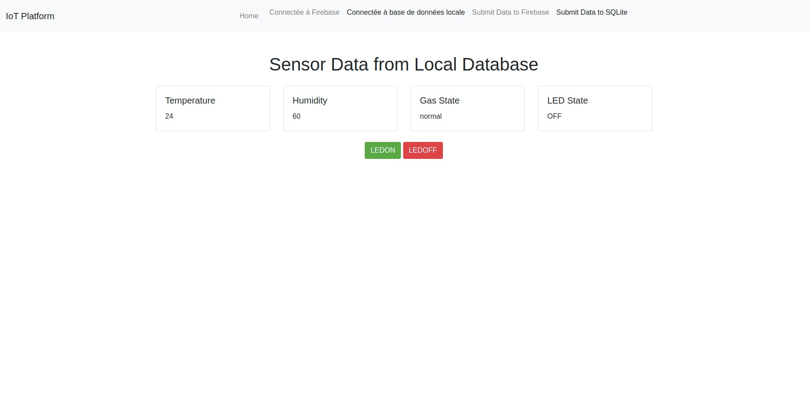
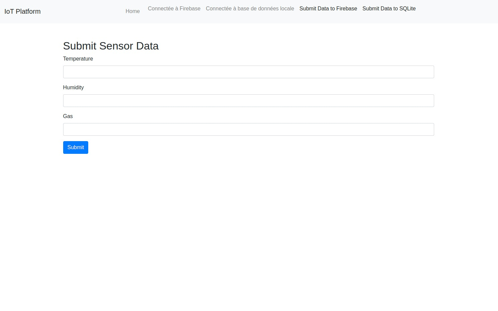
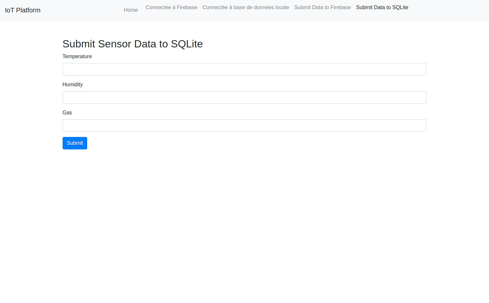
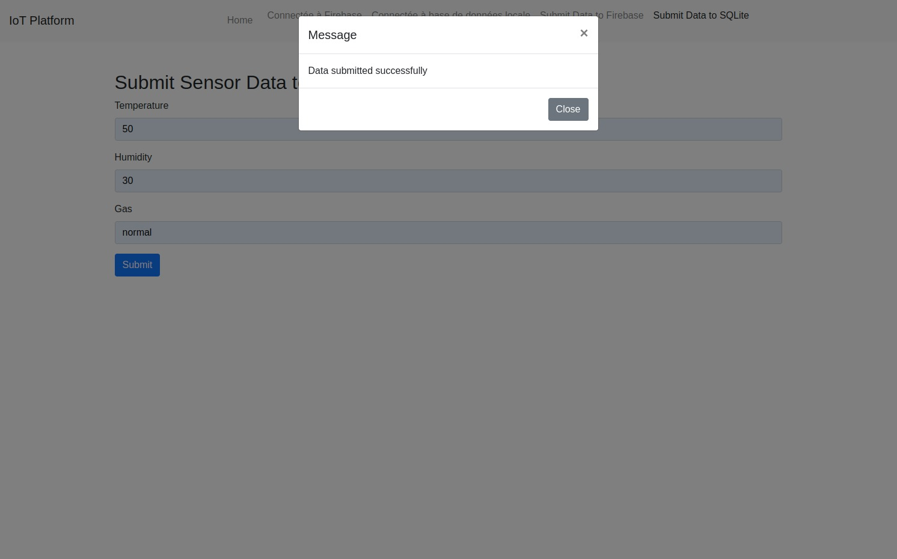
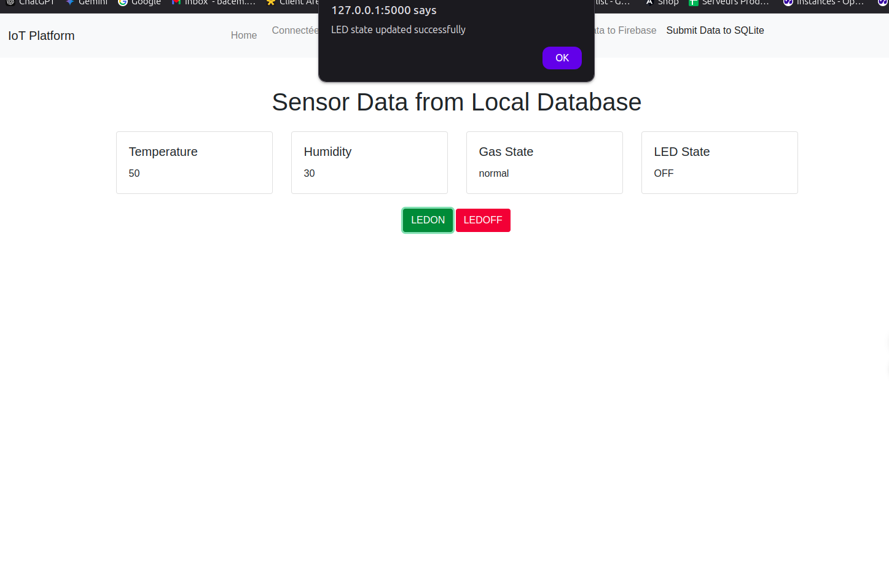
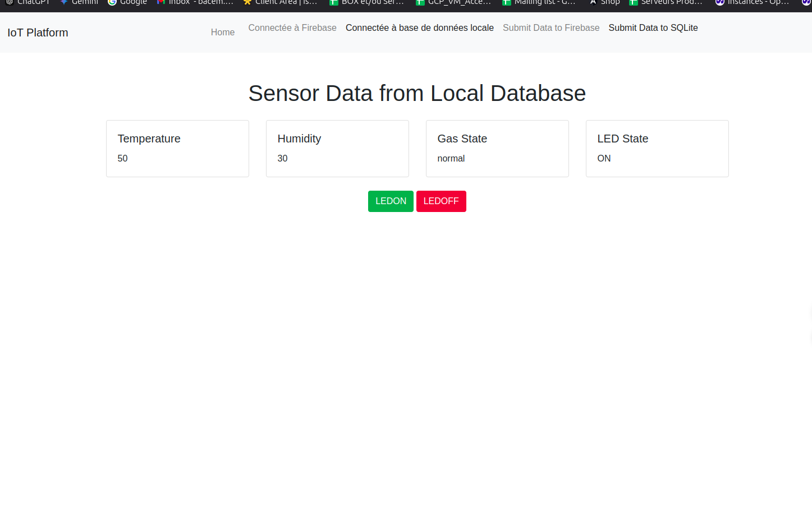
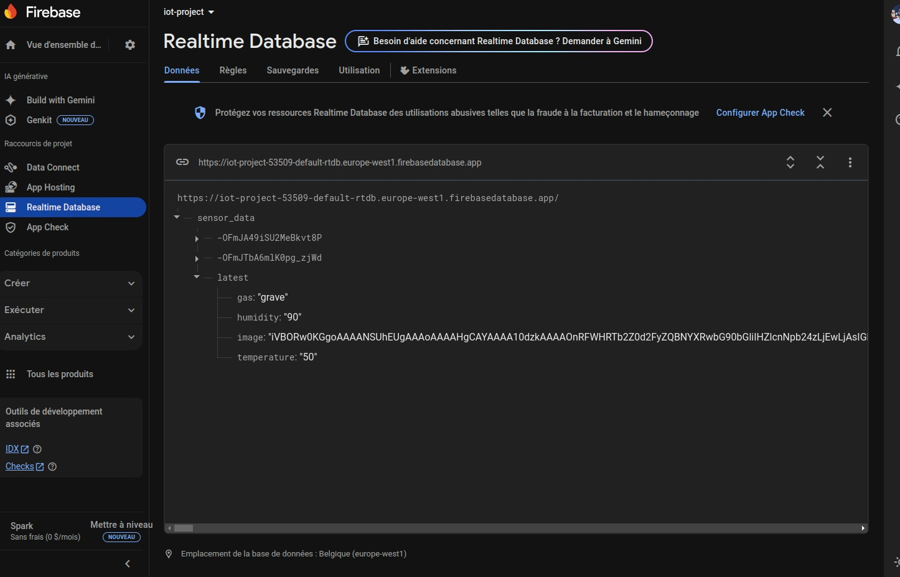
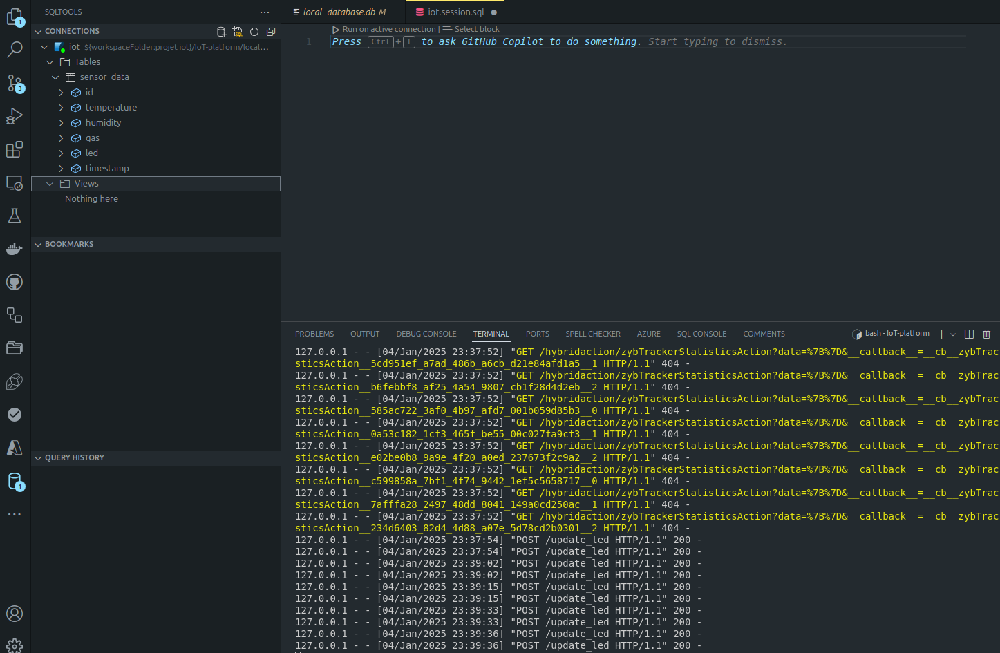

# IoT Project

This repository contains a Flask project that serves web pages to display sensor data from Firebase and a local database. The project also includes functionality to update the LED state in the local database.

## Setup Instructions

### 1. Set up and run the Flask project

1. Clone the repository:
    ```bash
    git clone https://github.com/bacemhlabba/IoT-platform.git
    cd IoT-platform
    ```

2. Create a virtual environment and activate it:
    ```bash
    python3 -m venv venv
    source venv/bin/activate
    ```

3. Install the required dependencies:
    ```bash
    pip install -r requirements.txt
    ```

4. Run the Flask app:
    ```bash
    ./run.sh
    ```

### 2. Create and configure the Firebase project

1. Go to the [Firebase Console](https://console.firebase.google.com/) and create a new project.

2. Add a new web app to the project and follow the instructions to register the app.

3. Download the `firebase.json` file from the Firebase Console and place it in the root directory of the project.

4. Update the file with the Firebase configuration details.

### 3. Set up the local database

1. Run the migration script to create the `sensor_data` table and insert initial data:
    ```bash
    python3 migrate.py
    ```
OR 

 ```bash
    ./run.sh
```

### 4. Using Docker Compose

1. Make sure Docker and Docker Compose are installed on your machine.

2. Build and start the containers:
    ```bash
    docker-compose up --build
    ```

3. Open a web browser and go to `http://127.0.0.1:5000/` to access the index page.

## Running the App

1. Make sure the virtual environment is activated and the required dependencies are installed.

2. Run the Flask app:
    ```bash
    ./run.sh
    ```

3. Open a web browser and go to `http://127.0.0.1:5000/` to access the index page.

4. Use the navigation links to go to Page 1 and Page 2 to view the sensor data and update the LED state.

## Running Tests

After installing the dependencies, run the test suite using `pytest`:

```bash
pytest
```


## Project Structure

```
IoT-platform/
├── app/
│   ├── static/
│   ├── templates/
│   ├── __init__.py
│   ├── routes.py
│   └── models.py
├── migrations/
├── screenshots/
├── venv/
├── .gitignore
├── docker-compose.yml
├── Dockerfile
├── firebase.json
├── migrate.py
├── README.md
├── requirements.txt
└── run.sh
```

## Technologies Used

- Python
- Flask
- Firebase
- SQLite
- Docker
- Docker Compose
- HTML/CSS
- JavaScript

## Contributing

1. Fork the repository.
2. Create a new branch (`git checkout -b feature-branch`).
3. Make your changes.
4. Commit your changes (`git commit -m 'Add some feature'`).
5. Push to the branch (`git push origin feature-branch`).
6. Open a pull request.

## Screenshots

### Home Page


### Page 1 - Firebase Data


### Page 2 - Local Database Data


### Submit Data to Firebase


### Submit Data to SQLite


### Popup for Sensor Data


### LED State Update off


### LED State Update on


### Firebase Realtime


### SQLite Tables
